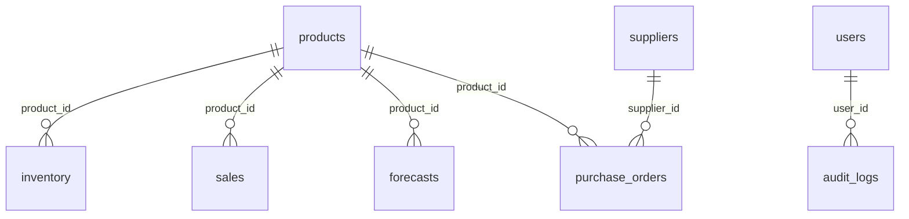

# 🤖 AI Smart Inventory Management & Demand Forecasting System

> **Enterprise AI Full Stack + Data Analytics + Machine Learning Project**


---

# 📌 Project Overview

The **AI Smart Inventory Management & Demand Forecasting System** is an enterprise-level project that combines **Full Stack Development**, **Data Analytics**, and **Artificial Intelligence** to solve real-world inventory management problems.

The system helps businesses:
- Track inventory
- Monitor stock levels
- Manage suppliers
- Record purchases
- Record sales
- Analyze historical business data
- Forecast future product demand
- Generate business insights through interactive dashboards

The project follows the **Data Analytics Life Cycle (DALC)** and is executed according to a **15-day enterprise roadmap**.

---

# 🎯 Business Problem

Many retail and warehouse businesses struggle with:
- Overstocking
- Understocking
- Manual inventory tracking
- Poor demand forecasting
- Delayed purchasing decisions
- Lack of business insights
- Inventory losses

The objective of this project is to eliminate these problems using analytics and AI.

---

# 🎯 Project Objectives

The project aims to:
- Develop a modern inventory management application
- Build REST APIs for inventory operations
- Store business data in SQLite
- Extract and clean transactional data
- Perform Exploratory Data Analysis (EDA)
- Build AI-driven demand forecasting
- Develop an interactive business dashboard
- Deliver business recommendations
- Demonstrate an end-to-end enterprise software development lifecycle

---

# 🏗️ Technology Stack

## Frontend
- HTML5
- CSS3
- JavaScript
- Chart.js / Plotly

## Backend
- Node.js
- Express.js
- REST APIs

## Database
- SQLite

## Data Analytics
- Python
- Pandas
- NumPy
- Matplotlib
- Plotly
- Jupyter Notebook

## Machine Learning
- Scikit-learn
- Time Series Forecasting
- Regression Models

## Version Control
- Git
- GitHub

---

# 📂 Repository Structure

```text
AI_Smart_Inventory_Management/
├── app/                  # Express.js backend & frontend assets
│   ├── src/              # Source code (controllers, models, routes, middleware)
│   ├── public/           # Static HTML/CSS/JS frontend views (placeholder)
│   ├── tests/            # Automated integration tests (Jest/Supertest)
│   └── package.json      # Node.js configurations and dependencies
├── analytics/            # Python data science & machine learning
│   ├── scripts/          # Forecast, seeding, and database verification scripts
│   ├── notebooks/        # Jupyter notebooks for EDA and modeling
│   └── requirements.txt  # Python dependencies
├── data/                 # SQLite database storage directory
│   └── inventory.db      # Active database file
├── docs/                 # System design, database design, API specification
├── DAILY_REPORTS/        # Daily status reports & verification logs
├── PROJECT_GUIDE.md      # Rules, roadmap, and guidelines master
├── PROJECT_TRACKER.md    # Progress tracking spreadsheet/markdown
├── CURRENT_DAY.md        # Automation control block for current day
├── DAILY_REPORT_TEMPLATE.md
├── README.md
└── .gitignore
```

---

# 📊 Data Analytics Life Cycle (DALC)

This project follows the complete DALC process:
1. Business Understanding
2. Data Acquisition
3. Data Preparation
4. Exploratory Data Analysis
5. Machine Learning
6. Validation
7. Deployment
8. Monitoring

---

# 🗓️ 15-Day Roadmap Summary

| Phase | Days | Goal |
|--------|------|------|
| Phase 0 | Day 1 | Setup & Onboarding |
| Phase 1 | Day 2 | Business Understanding & System Design |
| Phase 2 | Day 3–5 | Database & Backend APIs |
| Phase 3 | Day 6–7 | Data Extraction & Cleaning |
| Phase 4 | Day 8–9 | Exploratory Data Analysis |
| Phase 5 | Day 10–11 | Dashboard & Frontend |
| Phase 6 | Day 12 | Testing & Security |
| Phase 7 | Day 13–14 | Documentation & Presentation |
| Phase 8 | Day 15 | Final Demo & Deployment |

---

# 🚀 Getting Started

## Prerequisites
- Git
- Node.js
- Python 3.11+
- VS Code
- SQLite

---

## Clone the Repository
```bash
git clone <repository-url>
cd AI_Smart_Inventory_Management
```

---

## Backend Setup
```bash
cd app
npm install
npm start
```

---

## Python Analytics Setup
```bash
cd analytics
python -m venv venv

# Windows (Command Prompt or PowerShell)
venv\Scripts\activate

# macOS/Linux
source venv/bin/activate

pip install -r requirements.txt
```

---

## Database Setup
The SQLite database schema and indexes are automatically initialized when the backend server runs for the first time.

To generate 1,000+ rows of historical sales, products, suppliers, and transaction records:
```bash
cd analytics
# Make sure your virtual environment is active
python scripts/seed_data.py
```

To verify the database structure and counts:
```bash
cd app
node src/verify_db.js
```

---

## 🤖 Machine Learning Workflow

The demand forecasting pipeline is implemented in Python using scikit-learn. It follows a structured ML lifecycle:

### Forecasting Process

```
Raw Sales Data
      │
      ▼
Daily SKU Aggregation  ←──  Calendar Gap Filling (zeros)
      │
      ▼
Feature Engineering
  • Lag features: lag_1, lag_7, lag_14, lag_30
  • Rolling averages: 7, 14, 30 days
  • Rolling volatility: std_7, std_14, std_30
  • Calendar: day_of_week, month, quarter, is_weekend
      │
      ▼
Temporal Train/Validation Split
  (Last 60 days = validation hold-out)
      │
      ▼
Model Training (5 algorithms)
  1. Linear Regression
  2. Gradient Boosting
  3. Random Forest (Baseline)
  4. Random Forest (Tuned via RandomizedSearchCV)
  5. XGBoost (if installed)
      │
      ▼
Evaluation: MAE, MSE, RMSE, R²
      │
      ▼
Champion Selection (lowest RMSE)
      │
      ▼
30-Day Recursive Forecasting per SKU
      │
      ▼
Safety Stock & Reorder Points → SQLite + CSV
```

### Model Selection Results

| Model | MAE | RMSE | R² | Status |
|-------|-----|------|----|--------|
| Random Forest (Tuned) | 1.2525 | 3.8378 | 0.0037 | ✅ Champion |
| Linear Regression | 1.1769 | 3.8461 | -0.0007 | Runner-up |
| Random Forest (Baseline) | 1.5175 | 3.9560 | -0.0587 | |
| Gradient Boosting | 1.7261 | 4.0259 | -0.0964 | |
| XGBoost | 1.9908 | 4.1547 | -0.1677 | |

**Champion**: `Random Forest (Tuned)` — n_estimators=150, max_depth=6, min_samples_leaf=6

### Top Features by Importance
1. `rolling_std_30` — 16.57% (30-day demand volatility)
2. `rolling_mean_14` — 12.23% (14-day average demand)
3. `rolling_mean_30` — 11.04% (30-day average demand)
4. `rolling_std_7` — 9.53% (short-term volatility)
5. `day_of_week` — 8.39% (weekly demand cycles)

### Retraining Instructions

```bash
# Activate the Python virtual environment
cd AI_Smart_Inventory_Management
analytics\venv\Scripts\activate

# Step 1: Run model optimization (trains all models, selects champion)
python analytics/scripts/model_optimization.py

# Step 2: Generate 30-day forecasts using champion model
python analytics/scripts/train_forecast.py

# Step 3: Open the interactive optimization notebook
jupyter notebook analytics/notebooks/05_Model_Optimization.ipynb
```

### Model Artifacts

| Artifact | Path | Description |
|---------|------|-------------|
| Champion model | `models/best_forecasting_model.pkl` | Serialized joblib model |
| Metadata | `models/model_metadata.json` | Training info, metrics, features |
| Actual vs Predicted | `reports/figures/actual_vs_predicted.png` | Prediction accuracy chart |
| Residual Plot | `reports/figures/residual_plot.png` | Error distribution vs predictions |
| Error Histogram | `reports/figures/error_distribution.png` | Prediction error histogram |
| Feature Importance | `reports/figures/feature_importance.png` | Feature ranking chart |
| Model Comparison | `reports/figures/model_comparison.png` | Side-by-side metric comparison |
| Model Report | `docs/MODEL_REPORT.md` | Full ML model documentation |
| Evaluation Report | `docs/MODEL_EVALUATION.md` | Metrics, observations, limitations |
| Feature Analysis | `docs/FEATURE_IMPORTANCE.md` | Business interpretation of features |

---

# 🌐 API Documentation & Database Reference

## 1. API Overview
- **REST Architecture:** Follows standard RESTful practices using standard HTTP verbs (`GET`, `POST`, `PUT`, `PATCH`, `DELETE`). All payloads and response bodies are JSON objects.
- **Base URL:** `http://localhost:5000/api`
- **Authentication:** JWT Bearer Token. Include token in authorization headers for protected routes:
  `Authorization: Bearer <jwt_token>`
- **Envelope Response Format:**
  - **Success Response (200/201):**
    ```json
    {
      "success": true,
      "data": { ... },
      "message": "Operation description"
    }
    ```
  - **Error Response (400/401/403/404/409/500):**
    ```json
    {
      "success": false,
      "error": "Error description message",
      "statusCode": 400
    }
    ```

---

## 2. Authentication API

### POST /api/auth/login
- **Purpose:** Authenticate user and retrieve JWT token.
- **HTTP Method:** `POST`
- **URL:** `/api/auth/login`
- **Request Payload:**
  ```json
  {
    "email": "manager@inventory.com",
    "password": "securepassword"
  }
  ```
- **Success Response (200 OK):**
  ```json
  {
    "success": true,
    "data": {
      "access_token": "eyJhbGciOiJIUzI1NiIsInR5c...",
      "token_type": "Bearer",
      "user": {
        "user_id": "8b9db8d7-7cfa-4e78-be7f-f772ba65c192",
        "email": "manager@inventory.com",
        "full_name": "Ravi Kumar",
        "role": "Manager"
      }
    },
    "message": "Login successful"
  }
  ```
- **JWT Usage:** Store the returned `access_token` and append it in headers for all subsequent requests: `Authorization: Bearer <token>`.

### POST /api/auth/logout
- **Purpose:** Terminate user session.
- **HTTP Method:** `POST`
- **URL:** `/api/auth/logout`
- **Headers:** `Authorization: Bearer <jwt_token>`
- **Success Response (204 No Content):** (No response body)

---

## 3. Products API

### GET /api/products
- **Purpose:** Retrieve all products, optionally filtered by category or name search.
- **HTTP Method:** `GET`
- **URL:** `/api/products`
- **Headers:** `Authorization: Bearer <jwt_token>`
- **Query Params (Optional):**
  - `category` (string, e.g. `Electronics`)
  - `search` (string, e.g. `Smartphone`)
- **Success Response (200 OK):**
  ```json
  {
    "success": true,
    "data": [
      {
        "product_id": "a90f1190-8cfd-4d9a-8e2b-232a4e1501bc",
        "sku": "ELEC-001",
        "name": "Smartphone X",
        "category": "Electronics",
        "unit_cost": 10670.15,
        "reorder_point": 15,
        "created_at": "2026-06-30T10:00:00Z"
      }
    ]
  }
  ```

### GET /api/products/:id
- **Purpose:** Retrieve product details by product ID.
- **HTTP Method:** `GET`
- **URL:** `/api/products/a90f1190-8cfd-4d9a-8e2b-232a4e1501bc`
- **Headers:** `Authorization: Bearer <jwt_token>`
- **Success Response (200 OK):**
  ```json
  {
    "success": true,
    "data": {
      "product_id": "a90f1190-8cfd-4d9a-8e2b-232a4e1501bc",
      "sku": "ELEC-001",
      "name": "Smartphone X",
      "category": "Electronics",
      "unit_cost": 10670.15,
      "reorder_point": 15,
      "created_at": "2026-06-30T10:00:00Z"
    }
  }
  ```

### POST /api/products
- **Purpose:** Register a new product SKU in the master catalog.
- **HTTP Method:** `POST`
- **URL:** `/api/products`
- **Headers:** `Authorization: Bearer <jwt_token>`
- **Request Payload:**
  ```json
  {
    "sku": "ELEC-002",
    "name": "Wireless Earbuds Z",
    "category": "Electronics",
    "unit_cost": 1999.00,
    "reorder_point": 25
  }
  ```
- **Success Response (201 Created):**
  ```json
  {
    "success": true,
    "data": {
      "product_id": "3c98b2fa-48ef-4171-872f-48d946d9ac29",
      "sku": "ELEC-002",
      "name": "Wireless Earbuds Z",
      "category": "Electronics",
      "unit_cost": 1999.00,
      "reorder_point": 25,
      "created_at": "2026-06-30T18:15:30Z"
    },
    "message": "Product created successfully"
  }
  ```

### PUT /api/products/:id
- **Purpose:** Update metadata fields of an existing product SKU.
- **HTTP Method:** `PUT`
- **URL:** `/api/products/3c98b2fa-48ef-4171-872f-48d946d9ac29`
- **Headers:** `Authorization: Bearer <jwt_token>`
- **Request Payload (all fields optional):**
  ```json
  {
    "name": "Wireless Earbuds Z v2",
    "unit_cost": 1850.00
  }
  ```
- **Success Response (200 OK):**
  ```json
  {
    "success": true,
    "data": {
      "product_id": "3c98b2fa-48ef-4171-872f-48d946d9ac29",
      "sku": "ELEC-002",
      "name": "Wireless Earbuds Z v2",
      "category": "Electronics",
      "unit_cost": 1850.00,
      "reorder_point": 25,
      "created_at": "2026-06-30T18:15:30Z"
    },
    "message": "Product updated successfully"
  }
  ```

### DELETE /api/products/:id
- **Purpose:** Permanently remove product. *Requires Admin role.*
- **HTTP Method:** `DELETE`
- **URL:** `/api/products/3c98b2fa-48ef-4171-872f-48d946d9ac29`
- **Headers:** `Authorization: Bearer <jwt_token>`
- **Success Response (204 No Content):** (No response body)
- **Constraint:** Cannot delete product if referenced in other transaction tables (inventory, sales, POs) - returns 409 Conflict.

---

## 4. Inventory API

### GET /api/inventory
- **Purpose:** List current inventory items with joined product name, SKU, and low-stock alerts.
- **HTTP Method:** `GET`
- **URL:** `/api/inventory`
- **Headers:** `Authorization: Bearer <jwt_token>`
- **Success Response (200 OK):**
  ```json
  {
    "success": true,
    "data": [
      {
        "inventory_id": "4d1db2fa-8cfd-4d9a-8e2b-232a4e1501bc",
        "product_id": "a90f1190-8cfd-4d9a-8e2b-232a4e1501bc",
        "sku": "ELEC-001",
        "name": "Smartphone X",
        "quantity": 12,
        "location": "Warehouse-A",
        "reorder_point": 15,
        "low_stock": 1,
        "last_updated": "2026-06-30T18:12:45Z"
      }
    ]
  }
  ```

### GET /api/inventory/:product_id
- **Purpose:** Retrieve inventory levels for a specific product ID.
- **HTTP Method:** `GET`
- **URL:** `/api/inventory/a90f1190-8cfd-4d9a-8e2b-232a4e1501bc`
- **Headers:** `Authorization: Bearer <jwt_token>`
- **Success Response (200 OK):**
  ```json
  {
    "success": true,
    "data": {
      "inventory_id": "4d1db2fa-8cfd-4d9a-8e2b-232a4e1501bc",
      "product_id": "a90f1190-8cfd-4d9a-8e2b-232a4e1501bc",
      "quantity": 12,
      "location": "Warehouse-A",
      "last_updated": "2026-06-30T18:12:45Z",
      "low_stock": true
    }
  }
  ```

### PATCH /api/inventory/:product_id
- **Purpose:** Adjust stock levels manually (e.g., physical stock counts, damage write-offs). Writes audit log automatically.
- **HTTP Method:** `PATCH`
- **URL:** `/api/inventory/a90f1190-8cfd-4d9a-8e2b-232a4e1501bc`
- **Headers:** `Authorization: Bearer <jwt_token>`
- **Request Payload:**
  ```json
  {
    "quantity": 100,
    "location": "Warehouse-A",
    "reason": "Annual stock audit correction"
  }
  ```
- **Success Response (200 OK):**
  ```json
  {
    "success": true,
    "data": {
      "inventory_id": "4d1db2fa-8cfd-4d9a-8e2b-232a4e1501bc",
      "product_id": "a90f1190-8cfd-4d9a-8e2b-232a4e1501bc",
      "quantity": 100,
      "location": "Warehouse-A",
      "last_updated": "2026-06-30T18:32:00Z"
    },
    "message": "Inventory adjusted successfully"
  }
  ```

---

## 5. Supplier API

### GET /api/suppliers
- **Purpose:** Retrieve all registered suppliers.
- **HTTP Method:** `GET`
- **URL:** `/api/suppliers`
- **Headers:** `Authorization: Bearer <jwt_token>`
- **Success Response (200 OK):**
  ```json
  {
    "success": true,
    "data": [
      {
        "supplier_id": "31bfa82a-48cf-4d9c-be7f-f772ba65c192",
        "name": "Global Tech Corp",
        "contact_person": "Jane Doe",
        "contact_email": "jane@globaltech.com",
        "contact_phone": "+1-555-0199",
        "lead_time_days": 10,
        "rating": 4.8,
        "created_at": "2026-06-29T12:00:00Z"
      }
    ]
  }
  ```

### POST /api/suppliers
- **Purpose:** Create a new supplier.
- **HTTP Method:** `POST`
- **URL:** `/api/suppliers`
- **Headers:** `Authorization: Bearer <jwt_token>`
- **Request Payload:**
  ```json
  {
    "name": "Super Distributors",
    "contact_person": "Robert Smith",
    "contact_email": "robert@superdist.com",
    "contact_phone": "+1-555-0155",
    "lead_time_days": 5,
    "rating": 4.5
  }
  ```
- **Success Response (201 Created):**
  ```json
  {
    "success": true,
    "data": {
      "supplier_id": "ef28c465-4fef-4ea6-be53-da89656fa1bc",
      "name": "Super Distributors",
      "contact_person": "Robert Smith",
      "contact_email": "robert@superdist.com",
      "contact_phone": "+1-555-0155",
      "lead_time_days": 5,
      "rating": 4.5,
      "created_at": "2026-06-30T18:34:00Z"
    },
    "message": "Supplier created successfully"
  }
  ```

### PUT /api/suppliers/:id
- **Purpose:** Modify an existing supplier's details.
- **HTTP Method:** `PUT`
- **URL:** `/api/suppliers/ef28c465-4fef-4ea6-be53-da89656fa1bc`
- **Headers:** `Authorization: Bearer <jwt_token>`
- **Request Payload (all fields optional):**
  ```json
  {
    "contact_person": "Robert Smith Jr.",
    "lead_time_days": 6
  }
  ```
- **Success Response (200 OK):**
  ```json
  {
    "success": true,
    "data": {
      "supplier_id": "ef28c465-4fef-4ea6-be53-da89656fa1bc",
      "name": "Super Distributors",
      "contact_person": "Robert Smith Jr.",
      "contact_email": "robert@superdist.com",
      "contact_phone": "+1-555-0155",
      "lead_time_days": 6,
      "rating": 4.5,
      "created_at": "2026-06-30T18:34:00Z"
    },
    "message": "Supplier updated successfully"
  }
  ```

### DELETE /api/suppliers/:id
- **Purpose:** Delete a supplier record. *Requires Admin role.*
- **HTTP Method:** `DELETE`
- **URL:** `/api/suppliers/ef28c465-4fef-4ea6-be53-da89656fa1bc`
- **Headers:** `Authorization: Bearer <jwt_token>`
- **Success Response (204 No Content):** (No response body)

---

## 6. Sales API

### GET /api/sales
- **Purpose:** Retrieve historical sale transaction logs, optional filters for date range and product ID.
- **HTTP Method:** `GET`
- **URL:** `/api/sales`
- **Headers:** `Authorization: Bearer <jwt_token>`
- **Query Params (Optional):**
  - `product_id` (string, UUID filter)
  - `from` (string, ISO Date, e.g. `2026-01-01`)
  - `to` (string, ISO Date, e.g. `2026-06-30`)
- **Success Response (200 OK):**
  ```json
  {
    "success": true,
    "data": [
      {
        "sale_id": "5364d0fe-d5e3-4362-8126-b65652048c99",
        "product_id": "a90f1190-8cfd-4d9a-8e2b-232a4e1501bc",
        "sale_date": "2025-07-01",
        "quantity": 8,
        "unit_price": 10670.15,
        "customer_type": "Retail"
      }
    ]
  }
  ```

### POST /api/sales
- **Purpose:** Log a customer sales transaction and subtract quantity from inventory.
- **HTTP Method:** `POST`
- **URL:** `/api/sales`
- **Headers:** `Authorization: Bearer <jwt_token>`
- **Request Payload:**
  ```json
  {
    "product_id": "a90f1190-8cfd-4d9a-8e2b-232a4e1501bc",
    "sale_date": "2026-06-30",
    "quantity": 5,
    "unit_price": 10670.15,
    "customer_type": "Retail"
  }
  ```
- **Success Response (201 Created):**
  ```json
  {
    "success": true,
    "data": {
      "sale_id": "bc8c7432-843b-48ec-be56-da22986f1bc2",
      "product_id": "a90f1190-8cfd-4d9a-8e2b-232a4e1501bc",
      "sale_date": "2026-06-30",
      "quantity": 5,
      "unit_price": 10670.15,
      "customer_type": "Retail"
    },
    "message": "Sale transaction completed and stock decremented"
  }
  ```
- **Business Rule:** In the event that inventory stock falls below the requested purchase quantity, the order will fail and return a `400 Bad Request` with an "Insufficient stock" error.

---

## 7. Purchase Order API

### GET /api/purchase-orders
- **Purpose:** Retrieve all outgoing purchase orders, filtered by supplier or status.
- **HTTP Method:** `GET`
- **URL:** `/api/purchase-orders`
- **Headers:** `Authorization: Bearer <jwt_token>`
- **Query Params (Optional):**
  - `status` (`Pending`, `Approved`, `Shipped`, `Received`, `Cancelled`)
  - `supplier_id` (string, UUID filter)
- **Success Response (200 OK):**
  ```json
  {
    "success": true,
    "data": [
      {
        "po_id": "a9ef8cf3-da48-be22-3acb-ef19876fa1c2",
        "supplier_id": "31bfa82a-48cf-4d9c-be7f-f772ba65c192",
        "product_id": "a90f1190-8cfd-4d9a-8e2b-232a4e1501bc",
        "quantity": 50,
        "unit_cost": 9500.00,
        "status": "Pending",
        "order_date": "2026-06-30T18:35:00Z",
        "expected_delivery": "2026-07-10",
        "actual_delivery": null,
        "notes": "Urgent replenishment"
      }
    ]
  }
  ```

### GET /api/purchase-orders/:id
- **Purpose:** Fetch detailed attributes of a specific PO.
- **HTTP Method:** `GET`
- **URL:** `/api/purchase-orders/a9ef8cf3-da48-be22-3acb-ef19876fa1c2`
- **Headers:** `Authorization: Bearer <jwt_token>`
- **Success Response (200 OK):** (Returns PO object details).

### POST /api/purchase-orders
- **Purpose:** File a new purchase order to a supplier. Default status is initialized to `Pending`.
- **HTTP Method:** `POST`
- **URL:** `/api/purchase-orders`
- **Headers:** `Authorization: Bearer <jwt_token>`
- **Request Payload:**
  ```json
  {
    "supplier_id": "31bfa82a-48cf-4d9c-be7f-f772ba65c192",
    "product_id": "a90f1190-8cfd-4d9a-8e2b-232a4e1501bc",
    "quantity": 50,
    "unit_cost": 9500.00,
    "expected_delivery": "2026-07-10",
    "notes": "Urgent replenishment"
  }
  ```
- **Success Response (201 Created):** (Returns created PO object with status "Pending").

### PATCH /api/purchase-orders/:id
- **Purpose:** Transition status of a purchase order (e.g. mark it as Received).
- **HTTP Method:** `PATCH`
- **URL:** `/api/purchase-orders/a9ef8cf3-da48-be22-3acb-ef19876fa1c2`
- **Headers:** `Authorization: Bearer <jwt_token>`
- **Request Payload:**
  ```json
  {
    "status": "Received",
    "actual_delivery": "2026-07-08"
  }
  ```
- **Success Response (200 OK):** (Returns updated PO details).
- **Business Rule:** When transitioning from an active status (`Pending`, `Approved`, `Shipped`) to `Received`, the system automatically increments the inventory record of the associated product by the order quantity.

---

## 8. Forecast API

### POST /api/forecasts
- **Purpose:** Trigger the Python ML forecasting script (`analytics/scripts/forecast.py`) for a given product and period.
- **HTTP Method:** `POST`
- **URL:** `/api/forecasts`
- **Headers:** `Authorization: Bearer <jwt_token>`
- **Request Payload:**
  ```json
  {
    "product_id": "a90f1190-8cfd-4d9a-8e2b-232a4e1501bc",
    "horizon_days": 30
  }
  ```
- **Success Response (200 OK):**
  ```json
  {
    "success": true,
    "data": {
      "product_id": "a90f1190-8cfd-4d9a-8e2b-232a4e1501bc",
      "forecast_date": "2026-07-30",
      "predicted_qty": 13,
      "confidence_low": 8,
      "confidence_high": 18,
      "model_used": "ARIMA(2,1,2)",
      "generated_at": "2026-06-30T18:40:00Z"
    },
    "message": "Forecast run completed successfully"
  }
  ```

### GET /api/forecasts/:product_id
- **Purpose:** Retrieve the most recent demand forecast records for a product.
- **HTTP Method:** `GET`
- **URL:** `/api/forecasts/a90f1190-8cfd-4d9a-8e2b-232a4e1501bc`
- **Headers:** `Authorization: Bearer <jwt_token>`
- **Success Response (200 OK):**
  ```json
  {
    "success": true,
    "data": [
      {
        "forecast_id": "92fcfb2e-4b48-be22-3acb-ef19876fa1c2",
        "product_id": "a90f1190-8cfd-4d9a-8e2b-232a4e1501bc",
        "forecast_date": "2026-07-30",
        "predicted_qty": 13,
        "confidence_low": 8,
        "confidence_high": 18,
        "model_used": "ARIMA(2,1,2)",
        "generated_at": "2026-06-30T18:40:00Z"
      }
    ]
  }
  ```

---

## 9. Dashboard API

### GET /api/dashboard/summary
- **Purpose:** Aggregate key metrics to populate dashboard widgets and KPI cards.
- **HTTP Method:** `GET`
- **URL:** `/api/dashboard/summary`
- **Headers:** `Authorization: Bearer <jwt_token>`
- **Success Response (200 OK):**
  ```json
  {
    "success": true,
    "data": {
      "total_products": 51,
      "low_stock_count": 7,
      "total_inventory_value": 2420450.00,
      "pending_orders": 3,
      "stockout_rate": 5.4,
      "monthly_sales_total": 450900.25
    }
  }
  ```

---

## 10. Error Responses

All error payloads maintain a standard model. Here are JSON examples for typical codes:

### 400 Bad Request (Validation Error)
```json
{
  "success": false,
  "error": "Validation failed: quantity must be an integer greater than 0",
  "statusCode": 400
}
```

### 401 Unauthorized (Missing/Expired JWT Token)
```json
{
  "success": false,
  "error": "Access denied: Missing or invalid authentication token",
  "statusCode": 401
}
```

### 403 Forbidden (Unauthorized Role Privilege)
```json
{
  "success": false,
  "error": "Access denied: Admin role required for this operation",
  "statusCode": 403
}
```

### 404 Not Found (Resource Does Not Exist)
```json
{
  "success": false,
  "error": "Product with ID '3c98b2fa-48ef-4171-872f-48d946d9ac29' not found",
  "statusCode": 404
}
```

### 409 Conflict (Foreign Key Constraint Block)
```json
{
  "success": false,
  "error": "Conflict: Cannot delete product. It is referenced in sales transactions.",
  "statusCode": 409
}
```

### 500 Internal Server Error (Unexpected server exceptions)
```json
{
  "success": false,
  "error": "Internal Server Error: Database is locked or experienced an error",
  "statusCode": 500
}
```

---

## 11. Validation Rules
The system enforces strict input schema parsing through `app/middleware/validation.js`:

| Input Resource | Field | Constraint / Rule |
|----------------|-------|-------------------|
| **Products** | `sku` | Required, string, unique index, max 50 characters. |
| | `name` | Required, string, max 200 characters. |
| | `unit_cost` | Required, numeric float >= 0.00. |
| | `reorder_point` | Optional, integer >= 0. Default: 10. |
| **Inventory** | `quantity` | Required, integer >= 0. |
| | `location` | Required, string, e.g. `Warehouse-A`. |
| | `reason` | Required, string (minimum 5 chars) explaining adjustment for audit logs. |
| **Suppliers** | `name` | Required, string. |
| | `contact_email` | Required, valid email string format. |
| | `lead_time_days`| Required, integer >= 1. |
| | `rating` | Optional, float from 0.0 to 5.0. |
| **Sales** | `quantity` | Required, integer > 0. |
| | `unit_price` | Required, float > 0.00. |
| | `sale_date` | Required, ISO8601 Date string format (`YYYY-MM-DD`). |
| **POs** | `status` | Must belong to: `Pending`, `Approved`, `Shipped`, `Received`, `Cancelled`. |
| | `quantity` | Required, integer > 0. |

---

## 12. API Testing

### curl Examples

1. **Authentication (Login):**
   ```bash
   curl -X POST http://localhost:5000/api/auth/login \
     -H "Content-Type: application/json" \
     -d "{\"email\":\"manager@inventory.com\",\"password\":\"securepassword\"}"
   ```

2. **Retrieve Products (Authenticated):**
   ```bash
   curl -X GET http://localhost:5000/api/products \
     -H "Authorization: Bearer <your_jwt_token_here>"
   ```

3. **Record a Sale Transaction:**
   ```bash
   curl -X POST http://localhost:5000/api/sales \
     -H "Authorization: Bearer <your_jwt_token_here>" \
     -H "Content-Type: application/json" \
     -d "{\"product_id\":\"a90f1190-8cfd-4d9a-8e2b-232a4e1501bc\",\"sale_date\":\"2026-06-30\",\"quantity\":2,\"unit_price\":10670.15,\"customer_type\":\"Retail\"}"
   ```

### PowerShell Example
```powershell
# 1. Login to get token
$loginBody = @{ email = "manager@inventory.com"; password = "securepassword" } | ConvertTo-Json
$response = Invoke-RestMethod -Method Post -Uri "http://localhost:5000/api/auth/login" -ContentType "application/json" -Body $loginBody
$token = $response.data.access_token

# 2. Get Products list
$headers = @{ Authorization = "Bearer $token" }
$products = Invoke-RestMethod -Method Get -Uri "http://localhost:5000/api/products" -Headers $headers
$products.data | Format-Table -Property sku, name, unit_cost
```

### Running Automated Jest Tests
The Jest/Supertest suite checks authentication guards, API validations, and SQL transaction triggers:
```bash
cd app
# Execute full suite with automatic process exit logic
npx jest --forceExit --testTimeout=30000
```
- **Expected Results:** `12 passed, 12 total`

---

## 13. Database Summary
The project operates a relational structure stored in SQLite 3 (`data/inventory.db`).

### Schema Overview



- **Relationships:**
  - Foreign keys are strictly locked using `ON DELETE RESTRICT` to enforce structural integrity.
  - Relational indexes are applied to quicken lookups (e.g. indexed date filters and composite lookup keys).
- **Relational Indexes (14 Total):**
  - Unique keys: `products(sku)`, `users(email)`.
  - Filter indexes: `products(category)`, `inventory(product_id)`, `inventory(location)`, `sales(product_id)`, `sales(sale_date)`, `sales(product_id, sale_date)`, `forecasts(product_id)`, `forecasts(forecast_date)`, `purchase_orders(supplier_id)`, `purchase_orders(product_id)`, `purchase_orders(status)`, `users(role)`.

### Operational Seed Records (Actual Count)
- `products`: 51 products
- `inventory`: 50 inventory stock entries
- `suppliers`: 10 supplier contacts
- `sales`: 906 transactions
- `purchase_orders`: 105 procurement entries
- `users`: 5 staff credentials
- `forecasts`: 1 forecast simulation log
- `audit_logs`: 28 adjustment log entries

---

## 14. Project Folder Structure

```text
app/
├── config/              # Configuration files
├── middleware/          # Express route middlewares
│   ├── auth.js          # JWT checking and decoding
│   ├── errorHandler.js  # Unified JSON error parsing
│   └── validation.js    # JSON validation schemas
├── public/              # Static frontend resources (placeholder)
├── src/                 # Application code
│   ├── controllers/     # Controller handlers (auth, product, sales, PO, dashboard...)
│   ├── models/          # Promisified raw SQLite database models
│   ├── routes/          # Express route registry mounts
│   ├── database.js      # Relational DDL configuration and setup script
│   ├── server.js        # Server mounting configurations
│   └── verify_db.js     # Standalone validation and testing script
├── tests/               # Backend testing folder
│   └── api.test.js      # Jest integration testing file
├── package.json         # Dependancies configurations
└── package-lock.json    # Resolved dependencies list
```

---

## 15. Detailed Setup & Migration Steps

1. **Install Node.js & Python:** Install Node (v18+) and Python (v3.11+) globally on your machine.
2. **Setup virtual environment:** Create and run your environment under the analytics directory:
   ```bash
   cd analytics
   python -m venv venv
   # PowerShell/Cmd
   .\venv\Scripts\activate
   # Bash/zsh
   source venv/bin/activate
   pip install -r requirements.txt
   ```
3. **Install Node Dependencies:** Navigate to `app` and run install:
   ```bash
   cd ../app
   npm install
   ```
4. **Create Database Schema:** Start the backend application to trigger connection and tables build:
   ```bash
   npm start
   ```
   *Note: On startup, `src/database.js` runs automatically, building all 8 tables and 14 indexes if `data/inventory.db` doesn't exist.*
5. **Seed Database:** Seed historical transactions from Python:
   ```bash
   cd ../analytics
   # Ensure python venv is active
   python scripts/seed_data.py
   ```
6. **Verify Database:** Run validation from Node.js:
   ```bash
   cd ../app
   node src/verify_db.js
   ```
7. **Run Jest Tests:** Ensure all features operate cleanly:
   ```bash
   npx jest --forceExit
   ```

---

# 🔬 Phase 3 – Data Pipeline Architecture

## Overview

Day 6–7 introduced a fully automated, configuration-driven, enterprise-grade ETL pipeline (`pipeline/`) built with Python + Pandas. It extracts raw data from SQLite, cleans it, performs feature engineering, validates data quality, generates professional reports, and exports analytics-ready datasets in multiple formats.

---

## Pipeline Architecture

```text
pipeline/
├── pipeline.py         # CLI orchestrator — single-entry point for full run
├── extract.py          # Connects to SQLite and loads all 8 tables into DataFrames
├── clean.py            # Data quality profiling, null imputation, outlier capping (IQR)
├── transform.py        # Feature engineering — 20+ derived columns
├── validate.py         # Schema validation, FK checks, business rule assertions
├── export.py           # Multi-format export (CSV, XLSX, Parquet, Pickle)
├── data_profile.py     # Structural profiling report generator
├── quality.py          # Data quality scorecard (6 dimensions, weighted score)
└── utils.py            # Logging, settings accessor, helpers

config/
├── config.yaml         # Default pipeline configuration (all options)
└── settings.py         # Pydantic settings engine — reads YAML + env overrides

tests/
├── conftest.py         # Shared pytest fixtures (temp DB, mock settings)
├── test_extract.py     # Extraction unit tests
├── test_clean.py       # Cleaning and profiling unit tests
├── test_transform.py   # Feature engineering unit tests
├── test_validate.py    # Validation suite unit tests
├── test_export.py      # Export format tests
└── test_pipeline.py    # End-to-end integration test
```

---

## Data Flow

```text
[SQLite: inventory.db]
        │
        ▼
  extract.py  → raw DataFrames (8 tables)
        │
        ▼
  clean.py    → profiling → null imputation → outlier capping → data type correction
        │
        ▼
  transform.py → feature engineering → derived metrics → processed DataFrames
        │
        ▼
  validate.py → schema checks → business rules → FK integrity → validation report
        │
        ▼
  export.py   → CSV, XLSX, Parquet, Pickle → data/exports/
        │
        ▼
  pipeline.py → DATA_DICTIONARY.md, DATA_CLEANING_REPORT.md, DATA_PROFILE_REPORT.md,
                DATA_VALIDATION_REPORT.md, DATA_QUALITY_SCORECARD.md → docs/
```

---

## CLI Commands

All commands are run from the project root with the Python virtual environment active:

```bash
# Activate Python virtual environment (Windows)
analytics\venv\Scripts\activate

# Full pipeline run (recommended)
python pipeline/pipeline.py

# Run with data profiling report
python pipeline/pipeline.py --profile

# Run with validation report
python pipeline/pipeline.py --validate

# Run with profiling AND validation
python pipeline/pipeline.py --profile --validate

# Run only cleaning step (skip transform, export)
python pipeline/pipeline.py --clean-only

# Export in specific formats
python pipeline/pipeline.py --export csv xlsx

# Use a custom config file
python pipeline/pipeline.py --config config/config.yaml

# Verbose debug logging
python pipeline/pipeline.py --verbose

# Combined options
python pipeline/pipeline.py --profile --validate --export csv parquet --verbose
```

---

## Configuration Options (`config/config.yaml`)

The pipeline is configured entirely through `config/config.yaml`. Any field can also be overridden with environment variables.

```yaml
database:
  db_path: "./data/inventory.db"           # SQLite database path
  timeout_seconds: 30

export:
  export_dir: "./data/exports"             # Output folder for exported datasets
  export_formats: ["csv", "xlsx", "parquet", "pickle"]
  save_timestamped_archive: true           # Keep versioned archive copies

pipeline:
  outlier_multiplier: 1.5                  # IQR multiplier for outlier capping
  enable_profiling: false                  # Auto-generate DATA_PROFILE_REPORT.md
  enable_validation: false                 # Auto-generate DATA_VALIDATION_REPORT.md
  enable_quality_scorecard: true           # Auto-generate DATA_QUALITY_SCORECARD.md

logging:
  log_level: "INFO"                        # DEBUG | INFO | WARNING | ERROR
  log_dir: "./logs"
  log_file: "pipeline.log"
```

**Environment variable overrides** (prefix `INVENTORY_`):
```bash
export INVENTORY_DB_PATH="/path/to/custom.db"
export INVENTORY_EXPORT_DIR="/path/to/outputs"
export INVENTORY_LOG_LEVEL="DEBUG"
```

---

## Engineered Features (20+ Columns)

| Table | Feature Column | Description |
|-------|---------------|-------------|
| Products | `revenue_potential` | `unit_cost × reorder_point` |
| Products | `demand_category` | High / Medium / Low based on avg daily demand |
| Products | `avg_daily_demand` | Rolling historical average |
| Sales | `revenue` | `quantity × unit_price` |
| Sales | `profit` | `revenue − (quantity × unit_cost)` |
| Sales | `profit_margin_pct` | `profit / revenue × 100` |
| Sales | `week`, `month`, `quarter`, `year` | Calendar decomposition |
| Sales | `day_of_week`, `is_weekend`, `season` | Temporal pattern features |
| Sales | `rolling_sales_7d`, `rolling_sales_30d` | Rolling demand windows |
| Inventory | `inventory_value` | `quantity × unit_cost` |
| Inventory | `stock_status` | Critical / Low / Adequate / Excess |
| Inventory | `reorder_required` | Boolean flag for replenishment |
| Inventory | `days_until_stockout` | Estimated days remaining at avg demand |
| Inventory | `inventory_turnover` | Sales velocity vs stock held |
| Purchase Orders | `total_order_value` | `quantity × unit_cost` |
| Purchase Orders | `on_time_delivery` | Boolean — actual ≤ expected delivery |
| Purchase Orders | `lead_time_actual` | Days from order to actual delivery |
| Suppliers | `avg_lead_time`, `min_lead_time`, `max_lead_time` | Lead time statistics |
| Suppliers | `on_time_rate` | % of on-time deliveries |
| Suppliers | `total_order_value` | Cumulative spend per supplier |

---

## Generated Documents (`docs/`)

| Document | Description |
|----------|-------------|
| `DATA_DICTIONARY.md` | Column-by-column definitions, types, constraints for all 8 tables |
| `DATA_CLEANING_REPORT.md` | Null rates, imputation decisions, outlier counts, cleaning steps |
| `DATA_PROFILE_REPORT.md` | Row counts, dtype profiles, uniqueness, completeness per column |
| `DATA_VALIDATION_REPORT.md` | Schema compliance, FK integrity, business rule check results |
| `DATA_QUALITY_SCORECARD.md` | 6-dimension quality score (Completeness, Uniqueness, Accuracy...) |
| `performance_comparison.md` | Before/after optimization timing comparison |

---

## Running Tests

```bash
# Run full test suite (10 tests)
analytics\venv\Scripts\pytest tests\ -v

# Run individual test modules
analytics\venv\Scripts\pytest tests\test_extract.py -v
analytics\venv\Scripts\pytest tests\test_clean.py -v
analytics\venv\Scripts\pytest tests\test_transform.py -v
analytics\venv\Scripts\pytest tests\test_validate.py -v
analytics\venv\Scripts\pytest tests\test_export.py -v
analytics\venv\Scripts\pytest tests\test_pipeline.py -v
```

**Expected result:** `10 passed` ✅

---

## Troubleshooting

| Problem | Cause | Fix |
|---------|-------|-----|
| `ModuleNotFoundError: No module named 'pipeline'` | Running pytest from wrong directory | Run from project root: `analytics\venv\Scripts\pytest tests\` |
| `FileNotFoundError: inventory.db` | DB path mismatch in config | Set `INVENTORY_DB_PATH` env var or update `config.yaml` |
| `KeyError: 'user_id'` in clean.py | `audit_logs` table missing `user_id` column | Re-run seed script or apply migration: `ALTER TABLE audit_logs ADD COLUMN user_id TEXT` |
| `AttributeError: .dt accessor` | Datetime columns not parsed | Ensure `pd.to_datetime()` is called before `.dt.strftime()` — already fixed in `transform.py` |
| `ImportError: cannot import name ... from 'profile'` | Naming conflict with Python built-in `profile` module | Use `data_profile.py` instead of `profile.py` |
| Pipeline runs but exports empty | `export_dir` pointing to wrong path | Check `settings.export_dir` in logs, verify against `config.yaml` |
| Slow pipeline execution | Large dataset + apply() loops | Use `--verbose` flag to identify slow steps; vectorized ops already applied |

---

# 📊 Phase 4 – Exploratory Data Analysis & Insights

## Overview
Day 8 introduced comprehensive EDA across the cleaned and feature-engineered datasets. The pipeline evaluates statistical properties, generates publication-quality visualization assets across 5 business domains (sales, products, inventory, suppliers, forecasts), and addresses the core Phase 1 business questions.

## Key Visualizations & Deliverables
- **Notebooks**: `analytics/notebooks/02_Exploratory_Data_Analysis.ipynb` & `analytics/notebooks/03_Business_Insights.ipynb`
- **Script**: `analytics/scripts/run_eda_complete.py`
- **Output Directories**: `analytics/visuals/` divided into sub-folders (`sales/`, `products/`, `inventory/`, `suppliers/`, `forecasts/`) holding 36 distinct charts.
- **Reports**:
  - `analytics/reports/EDA_SUMMARY.md` — Statistical characteristics, distribution descriptions, and data patterns.
  - `analytics/reports/BUSINESS_INSIGHTS.md` — Answers to all 8 core business questions and 10 executive-level insights.
  - `analytics/reports/CHART_CATALOG.md` — Indexed listing of all 36 visualizations.

---

# 🔮 Phase 5 – Model Building & Forecasting

## Overview
Day 9 introduced an automated demand forecasting and safety stock modeling pipeline (`train_forecast.py`). The pipeline loads processed sales, aggregates them to daily series, handles missing dates, splits the history temporally, trains and evaluates predictive models, and exports the final 30-day ahead forecasts.

## Model Comparisons (Temporal Validation)
- **Baseline (SMA-30)**: Daily demand predicted by a trailing 30-day simple moving average.
- **Champion (Random Forest Regressor)**: Fits an ensemble on lag features (`lag_1`, `lag_7`, `lag_14`, `lag_30`), rolling window features (mean and std over 7, 14, 30 days), and calendar indicators.
- **Evaluation Metrics**: Models are compared on MAE and RMSE across a 60-day validation set. Random Forest was selected as the champion model.

## Calculations
- **Safety Stock**: `Safety Stock = Z × σ_daily × √lead_time_days` where $Z = 1.645$ (95% service level) and $\sigma$ is the standard deviation of forecasted daily demand.
- **Reorder Point**: `Reorder Point = avg_daily_demand × lead_time_days + Safety Stock`
- **Reorder Quantity**: `Reorder Quantity = avg_daily_demand × lead_time_days × 2 + Safety Stock`

## Running the Training and Forecasting Script
```bash
# Run training, comparison, safety stock calculations, DB updates, and CSV exports
python analytics/scripts/train_forecast.py
```

## Outputs & Deliverables
- **Forecasting Notebook**: `analytics/notebooks/04_Demand_Forecasting.ipynb`
- **Forecast Pipeline Script**: `analytics/scripts/train_forecast.py`
- **Database Table**: Writes forecasts back to the SQLite `forecasts` table.
- **Processed Exports**:
  - `data/processed/forecasts_processed.csv` — Summary 30-day forecast and safety stock parameters for all 50 active SKUs.
  - `data/processed/daily_forecasts.csv` — Daily prediction horizon rows (1,500 total rows).

---

# 🎨 Phase 6 – Integrated Dashboard & Frontend UI (Days 10–11)

## Overview
Phase 6 delivered a premium, highly responsive browser dashboard and management console (Multi-Page Application) integrated directly with backend REST endpoints and forecasting scripts.

## Core Pages & Features
- **Dashboard UI (`dashboard.html`)**: Features 8 high-level KPI metric cards and 6 interactive Chart.js visualizations covering sales volume, categorization distributions, low-stock warnings, and historical trends.
- **Product CRUD (`products.html`)**: Features paginated catalog tabular view, SKU search and categories filters, CSV data exports, and bulk CSV uploads.
- **Live Inventory (`inventory.html`)**: Tracks reserved, available, safety stock, and valuations. Features a stock adjustment form with audit tracking.
- **Sales Transaction Ledger (`sales.html`)**: Enables recording transactions with real-time stock decrement hooks.
- **Suppliers Console (`suppliers.html`)**: Toggleable grid/table views showing ratings, person-of-contacts, and lead times.
- **Purchase Orders (`purchase-orders.html`)**: Tracks PO lifecycles. Restores inventory quantities automatically upon transitioning PO to "Received" status.
- **Forecasting Dashboard (`forecasts.html`)**: Graphs predictive demand confidence intervals and provides interactive triggers to spawn the Python forecasting script.
- **Documentation Viewer (`reports.html`)**: Compiles system design markdown files directly into the browser viewport and exports tables to PDF/Excel via CDN libraries.

---

# 🛡️ Phase 6 – Verification, Automated Testing & Security Audits (Day 12)

## Overview
Day 12 focused on auditing system safety and expanding the Jest test suite with unit tests for error handling and input validation.

## Audits & Testing Accomplishments
- **SQL Injection Audit**: Confirmed 100% parameterization compliance across all backend model layers. All SQLite commands use `?` parameter placeholders. Dynamic column updates are whitelisted against strict string tables.
- **Validation Unit Testing (`validation.test.js`)**: Created a full unit test suite mocking Request/Response states to assert correct input boundaries across all 8 validation middleware schemas.
- **Central Error Handling Unit Testing (`errorHandler.test.js`)**: Asserts that status code overrides are respected, Console logs errors correctly, and fallbacks default to 500 JSON envelopes.
- **Flaky Timeout Remediation**: Increased forecasting test timeouts in `api.test.js` to `30000ms` to avoid failure during heavy statsmodels ARIMA fitting.
- **Result**: The complete test suite runs cleanly, confirming **40/40 tests passing**.

---

# 📦 Phase 7 – Packaging, README & Business Storytelling (Day 13)

## Overview
Phase 7 finalized repository packaging configurations, updated core documentation specifications, and detailed time-series forecasting comparisons.

## Deliverables
- **Business Recommendations**: Compiled [BUSINESS_STORYTELLING.md](file:///c:/Users/ushas/OneDrive/Desktop/Smart_Inventory_Project/AI_Smart_Inventory_Management/docs/BUSINESS_STORYTELLING.md) evaluating all 5 trained models (Champion: Tuned Random Forest with RMSE of 3.8378) and outlining dynamic ROP replenishment policies.
- **Database Alignment**: Summarized database normalization and index triggers in `DATABASE_DESIGN.md`.
- **System Architecture**: Added detailed routing and request lifecycles to `PROJECT_ARCHITECTURE.md`.
- **Verified Packaging**: Verified dependency compliance in `requirements.txt` and `package.json`.

---

# 📈 Project Workflow

Every development session follows the same process:
1. Read `CURRENT_DAY.md`
2. Review `PROJECT_GUIDE.md`
3. Check `PROJECT_TRACKER.md`
4. Complete only the current day's roadmap activities
5. Verify deliverables
6. Update the tracker
7. Generate a daily report
8. Update `CURRENT_DAY.md`
9. Stop and wait for approval

---

# 📋 Documentation

Project documentation includes:
- `PROJECT_GUIDE.md` – Master operating guide
- `PROJECT_TRACKER.md` – Enterprise tracker
- `CURRENT_DAY.md` – Current execution day controller
- `DAILY_REPORT_TEMPLATE.md` – Daily reporting
- `docs/` – Business, architecture, database, API, testing, deployment documentation
- `docs/BUSINESS_STORYTELLING.md` – Model comparison metrics and operational recommendations

---

# 📦 Expected Deliverables

By the end of the project, the repository should contain:
- Functional Full Stack Inventory Application
- SQLite Database
- REST APIs
- Historical Dataset
- Data Cleaning Pipeline
- EDA Notebook
- Interactive Dashboard
- Demand Forecasting Model
- Insights Report & Storytelling Summaries
- Presentation Deck
- Complete Documentation & Unit Test Suites

---

# 🔮 Future Enhancements

Potential future improvements include:
- Role-Based Access Control (RBAC)
- Email Notifications
- Cloud Deployment (AWS/Heroku/Render)
- Docker Containerization
- CI/CD Pipeline (GitHub Actions)
- Real-Time Inventory Analytics
- AI-Driven Chat Assistant for Stock Queries
- Mobile Application (React Native)

---

# 📜 License

This project is developed for educational and portfolio purposes.

---

# 🤖 Instructions for Antigravity

Before every development session:
1. Read `CURRENT_DAY.md`
2. Read `PROJECT_GUIDE.md`
3. Open `PROJECT_TRACKER.md`
4. Execute only the current day's activities
5. Verify all deliverables
6. Update documentation
7. Create the daily report
8. Stop

Never skip roadmap phases.
Never merge multiple days.
Never implement future tasks before the current day is complete.

---

# 👩‍💻 Author

**Usha S**

Data Analytics • AI • Full Stack Development

---

**Status:** 🚀 Phase 7 Complete (Days 1–13 verified) | Day 14 (Final Presentation & Business Storytelling Deck) Next
